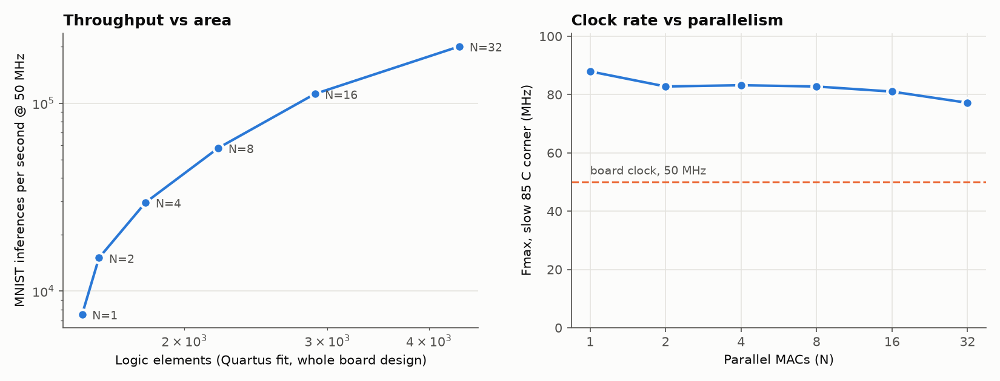

# DE2-115 Neural Network Inference Accelerator

A small neural network inference accelerator written in Verilog for the Terasic DE2-115
(Cyclone IV E, EP4CE115F29C7). The flow goes from training in Python to bit-exact fixed-point
verification in simulation, and then to hardware.

| Step | What | Status |
|---|---|---|
| 1 | Train a 2-4-1 XOR MLP in Python, quantize to Q8.8 | done |
| 2 | Export weights (.mif for Quartus, .hex for simulation), build a pipelined MAC unit | done |
| 3 | Self-checking testbench, verified against a bit-exact Python model | done, 455/455 pass |
| 4 | Full forward pass: .mif-initialized weight ROM, FSM sequencer, ReLU, board top level | done, 32/32 + board test pass |
| 5 | Program the DE2-115 and verify XOR on LEDs / 7-segment | compiled: 313 LEs, 98.84 MHz |
| 6 | MNIST: 196-32-10 on 14x14 digits, same `nn_core`, 16 test digits on the board | 1000/1000 bit-exact in sim, ready for the board |
| 7 | Parallel MACs: N = 1-32 lanes, speed vs area sweep in Quartus | 26.7x faster for 2.9x the LEs, 77-88 MHz Fmax, board run pending |

## Layout

```
python/fixedpoint.py       bit-exact fixed-point model (the golden reference)
python/train_xor.py        train, quantize, check quantized accuracy, export weights
python/gen_mac_vectors.py  generate stimulus + expected results for the MAC testbench
python/gen_nn_vectors.py   expected hidden/logit/class for the forward-pass testbench
python/train_mnist.py      MNIST: train 196-32-10, quantize, measure accuracy, export ROMs + vectors
python/gen_par_weights.py  re-pack the MNIST weights into one wide ROM per MAC count
python/plot_sweep.py       speed-vs-area plot + README table from the Quartus sweep CSV
weights/xor_weights.mif    Quartus memory init file (17 x 16-bit words)
weights/xor_weights.hex    same contents for $readmemh (this is what the ROM loads)
weights/mnist_*.hex/.mif   MNIST weights (6634 words), 16 demo images, their labels
weights/mnist_weights_parNN.hex  the same weights, N words per row, for N = 01..32 MACs
rtl/mac.v                  parameterized 2-stage pipelined multiply-accumulate unit
rtl/weight_rom.v           M9K ROM, initialized with $readmemh (simulation and Quartus)
rtl/nn_core.v              2-layer MLP forward pass: FSM + ROM + one MAC
rtl/nn_core_par.v          the same forward pass on N_MAC parallel MACs (MNIST board top uses this)
rtl/hex7seg.v              7-segment decoder
rtl/de2_115_top.v          XOR board top level: switches in, LEDs + 7-segment out
rtl/de2_115_mnist_top.v    MNIST board top level: image ROM, SW selects a digit, HEX shows result
tb/tb_mac.v                self-checking MAC testbench
tb/tb_nn_core.v            self-checking forward-pass testbench
tb/tb_top.v                board-level test (switches -> LEDs / HEX digits)
tb/tb_mnist.v              MNIST forward pass on 1000 test images vs Python, bit for bit
tb/tb_mnist_par.v          nn_core_par vs Python, bit for bit, for any N_MAC
tb/tb_mnist_top.v          MNIST board-level test (all 16 stored digits)
tb/vectors/                generated stimulus / expected results
sim/run_modelsim.do        ModelSim script (takes the testbench name)
sim/run_iverilog.sh        runs all testbenches with Icarus Verilog
quartus/de2_115_top.*      ready-made Quartus project for the XOR board demo
quartus/de2_115_mnist.*    ready-made Quartus project for the MNIST board demo
quartus/sweep_n_mac.tcl    compiles the MNIST design for N_MAC = 1..32, writes results/n_mac_sweep.csv
quartus/mac.sdc, mac_virtual_pins.tcl   for fitting the MAC on its own
.github/workflows/sim.yml  CI: regenerates vectors and runs every testbench on each push
```

## Fixed-point format: Q8.8

All weights, biases and activations are **16-bit signed Q8.8**: 8 integer bits (including the sign)
and 8 fractional bits. The range is [-128, +127.996] and the resolution is 1/256 ≈ 0.0039.

Why this format:

- **It fits the hardware.** The Cyclone IV E has 266 embedded 18x18 multipliers. A 16x16 signed
  multiply uses exactly one of them, with no LUT logic.
- **It has range headroom.** The trained XOR weights span [-7.27, +4.35], and the output
  pre-activation reaches -8.48. Q4.4 (8-bit, range ±8) still classifies XOR correctly, but I checked
  and the output logits pin at the rails (+7.94 / -8.00). That leaves no margin. For MNIST, where
  each neuron sums hundreds of products, Q4.4 would overflow in the hidden layers.
- **It has enough resolution.** The largest quantization error on the XOR weights is 0.0018, which is
  under half an LSB. Q4.4 has a 1/16 LSB, which rounds small weights such as 0.05 to zero.
- **It is a common choice** in real edge inference hardware, and it makes the math easy to follow in
  waveforms: 1.0 = 0x0100.

Each arithmetic step keeps full precision until the end:

| Signal | Width | Format | Notes |
|---|---|---|---|
| a, b | 16 | Q8.8 | weight × activation |
| product | 32 | Q16.16 | exact, no rounding |
| accumulator | 40 | Q24.16 | 8 guard bits, so ≥256 worst-case products sum without overflow |
| result | 16 | Q8.8 | round half up, then **saturate** (clamp) instead of wrapping |

Saturation matters because a wrapped overflow turns a large positive activation into a large
negative one, which silently flips classifications.

**Bias** is fed to the MAC as one extra term with b = 1.0 (0x0100), so the MAC needs no bias port.
**Output activation:** training uses a sigmoid, but sigmoid(z) > 0.5 exactly when z > 0, so the
hardware just checks the sign bit of the output logit. ReLU on the hidden layer is a single mux.

## Step 1-2: train and export

Needs Python 3 and numpy (`pip install numpy`). Run from the repo root:

```
python3 python/train_xor.py
```

```
seed 0, final BCE loss 0.00073
weight range [-7.267, 4.346], max quantization error 0.00182 (LSB = 0.00391)

 x1 x2 | float p  | fixed z2 (Q8.8)      | class | expect
  0  0 | 0.0021   |  -1579 ( -6.1680)    |   0   |   0
  0  1 | 0.9997   |   2077 ( +8.1133)    |   1   |   1
  1  0 | 0.9997   |   2077 ( +8.1133)    |   1   |   1
  1  1 | 0.0002   |  -2171 ( -8.4805)    |   0   |   0
quantized network classifies all 4 XOR inputs correctly
```

The "fixed" column comes from the integer model, which is bit-exact with the hardware. It is not a
float approximation.

Weight memory map (one 16-bit word per address), shared by the .mif and the .hex:

| Address | Contents |
|---|---|
| 0-7 | W1[j][i], row-major (hidden neuron j, input i) |
| 8-11 | b1[0..3] |
| 12-15 | W2[0][0..3] |
| 16 | b2[0] |

## The MAC unit (`rtl/mac.v`)

Parameters: `DATA_W` (16), `FRAC_W` (8), `ACC_W` (40).

Pipeline: **stage 1** registers `a*b`, which maps onto the DSP block's output register. **Stage 2**
accumulates. It accepts one term per clock with no bubbles, including between dot products.

| Port | Meaning |
|---|---|
| `in_valid` | a/b carry a real term this cycle (idle cycles are ignored) |
| `in_start` | first term of a new dot product; reloads the accumulator (no clear cycle needed) |
| `in_last` | last term of the dot product |
| `out_done` | one-cycle pulse, 2 clocks after `in_last`, when `acc`/`result` are final |
| `acc` | full-precision 40-bit sum |
| `result` | rounded and saturated Q8.8 |

## Step 3: simulate

```
python3 python/gen_mac_vectors.py      # regenerate vectors (already checked in)
```

This produces 455 dot products (7,331 clock cycles) covering:
- directed arithmetic, including negative values and zero
- rounding edge cases, including exact half-LSB ties for both signs
- saturation at +max and -min
- 256 worst-case terms, which uses all 8 guard bits
- all 20 neuron computations of the trained XOR network
- back-to-back single-term dot products, where start and last are both set every cycle
- 400 random dot products of random length, with random idle cycles and garbage on the bus while
  idle

Python computes the expected `acc` and `result` for each one. The testbench compares them bit for bit
on every `out_done` and also checks that the number of results is correct.

### ModelSim (Intel FPGA Starter Edition)

In the ModelSim transcript window:

```
cd C:/path/to/de2-115-nn-accelerator/sim
do run_modelsim.do                 # MAC unit
do run_modelsim.do tb_nn_core      # full forward pass (FSM, ROM, MAC in the wave window)
do run_modelsim.do tb_top          # board top level
```

It compiles, loads the waveform, runs, and should print:

```
# TEST PASSED: 455 dot products (7331 cycles) matched the Python model
```

Set `VERBOSE` to 1 (`vsim -gVERBOSE=1 ...`) to print every check. Useful signals are already in the
wave window. Try zooming in on an XOR neuron and reading `result` in decimal: 256 = 1.0.

### Icarus Verilog (optional, no license)

```
sh sim/run_iverilog.sh      # runs all three testbenches
```

GitHub Actions runs the same script on every push. It also regenerates the test vectors from the
committed weights and fails if they drift.

### Is the testbench actually checking anything?

It was mutation-tested. Each of these deliberate bugs was injected into `mac.v`, and the testbench
failed every time:

| Injected bug | Failures |
|---|---|
| rounding adds 1 LSB instead of ½ LSB | 170 / 455 |
| accumulator subtracts instead of adds | 411 / 455 |
| accumulator ignores `in_valid` | 90 / 455 |
| saturation disabled (wraps on overflow) | 73 / 455 |

## Step 4: full forward pass (`rtl/nn_core.v`)

```
          +-----------+  weight   +-------+  result  +---------------------+
 addr --> | weight_rom|---------->|       |--------->| ReLU -> hidden[0:3] |---+
  ^       | (M9K,.mif)|           |  MAC  |          | logit[0]            |   |
  |       +-----------+  act      |       |          +---------------------+   |
 FSM ------------------------->   +-------+                                    |
 (layer, neuron, k)   x[i] / hidden[j] / 1.0 (bias)  <-------------------------+
```

A single MAC is shared by every neuron. The FSM walks the weight memory in the same order as the
memory map above. It streams one (weight, activation) pair per clock, puts neurons back to back,
and makes the bias the last term of each neuron. The ROM has one cycle of read latency, so the
activation and control bits are registered once to stay aligned with the weight. Results come
out of the MAC in the order they were issued. ReLU is applied as each hidden result is captured.
The output layer starts once all four hidden activations are back.

- **Latency:** 17 MAC terms, 27 clocks from `start` to `done`, which is 0.54 µs at 50 MHz. The
  pipeline drains once between layers.
- **Resources:** one 18x18 multiplier, one M9K block, and a few hundred LEs. Quartus reports the
  exact numbers.
- **Scales to MNIST:** `N_IN`, `N_HID` and `N_OUT` are parameters. With `N_OUT > 1`, `pred`
  becomes the argmax of the logits.

**Weight loading.** `weight_rom.v` fills its memory with `$readmemh(HEX_FILE)`, and Quartus
honours that for inferred ROMs, so the same .hex file initializes the M9K in the .sof and the
simulation model. `HEX_FILE` is a parameter, which is what lets one ROM module serve the XOR
weights, the MNIST weights and the MNIST image store. (Step 4 originally used a
`ram_init_file` attribute, but an attribute can't take a parameter.) Paths are relative to
`sim/` or `quartus/`, both one level below the repo root. The .mif files hold the same data with
comments.

**Verification.** `python/gen_nn_vectors.py` reads the weights back from `xor_weights.hex`,
which is exactly what the ROM holds. It computes the expected hidden activations, logit and class
for the 4 XOR inputs plus 28 random real-valued inputs, which exercise ReLU clamping. The
testbench checks all of them bit for bit:

```
x=(0,0)  logit=-6.167969  pred=0  (27 cycles)
x=(0,1)  logit=8.113281  pred=1  (27 cycles)
x=(1,0)  logit=8.113281  pred=1  (27 cycles)
x=(1,1)  logit=-8.480469  pred=0  (27 cycles)
TEST PASSED: 32 inferences matched the Python model, 27 cycles each
```

Mutation check: removing ReLU, reading the wrong bias address, or feeding 0 instead of 1.0 for the
bias each causes 80+ failures.

## Step 5: on the board

`rtl/de2_115_top.v` wires the core to the board. The core runs inference continuously, so the
display follows the switches right away.

| Board | Meaning |
|---|---|
| KEY0 | reset |
| SW1, SW0 | inputs x[1], x[0] (up = 1.0) |
| LEDR1, LEDR0 | echo the switches |
| **LEDG0** | predicted class: should light for 01 and 10 only |
| HEX0 | predicted class as a digit |
| HEX6 | `-` when the logit is negative |
| HEX5-HEX2 | the logit's magnitude in Q8.8 hex: `06.2B` means 0x062B / 256 = 6.168 |

What you should see, and what `tb/tb_top.v` checks in simulation:

| SW1 SW0 | LEDG0 | HEX6..HEX2 | logit |
|---|---|---|---|
| 0 0 | off | `- 06.2B` | -6.168 |
| 0 1 | on | `  08.1D` | +8.113 |
| 1 0 | on | `  08.1D` | +8.113 |
| 1 1 | off | `- 08.7B` | -8.480 |

### Build and program

1. In Quartus, **File > Open Project** and open `quartus/de2_115_top.qpf`. The device, source files,
   .mif, timing constraints and pins are already set.
2. **Processing > Start Compilation.**
3. Connect the board's USB-Blaster port, the one labeled BLASTER, and power it on. Then open
   **Tools > Programmer**. Select USB-Blaster under Hardware Setup, add
   `output_files/de2_115_top.sof`, check Program/Configure, and click Start.
4. Flip SW0 and SW1 and compare against the table above.

**Pins:** `de2_115_top.qsf` contains pin locations taken from the DE2-115 User Manual tables. The
port names match Terasic's golden top. If an LED or digit behaves oddly, import the official
`DE2_115.qsf` from the Terasic DE2-115 System CD (**Assignments > Import Assignments**). That file
is authoritative and also sets the I/O standards.

### Measured results (Quartus II 14.1, EP4CE115F29C7)

| Metric | Result |
|---|---|
| Logic elements | 313 / 114,480 (< 1%), 161 registers |
| Embedded multipliers | 2 9-bit elements (one 18x18), no LUT multiplier |
| Block memory | 1 M9K (272 bits of weights) |
| Fmax (Slow 1200mV 85C) | **98.84 MHz**, 9.88 ns setup slack at 50 MHz |
| Latency | 27 clocks: 0.54 µs at 50 MHz, 0.27 µs at Fmax |
| Throughput | 1.85 M inferences/s at 50 MHz, 3.66 M/s at Fmax |

## Step 6: MNIST digits

Same `nn_core`, same MAC, same Q8.8 arithmetic, bigger parameters:

```
14x14 pixels (196) -> Dense(32) -> ReLU -> Dense(10) -> argmax
```

### Training and quantization (`python/train_mnist.py`)

The 28x28 MNIST digits are 2x2 average-pooled to 14x14 and scaled to [0, 1]. A plain numpy MLP
(Adam, 20 epochs, small L2) is trained on 55k images, with 5k held out for validation. The weights
are then rounded to Q8.8 and the whole 10,000-image test set is run through a vectorized copy of
the hardware arithmetic (40-bit accumulator, round half up, saturate, ReLU, first-max argmax).

```
python3 python/train_mnist.py          # downloads MNIST once into data/ (git-ignored), ~10 s
test accuracy, float32 model : 96.17%
test accuracy, Q8.8 bit-exact: 96.16%  (9616 / 10000)
Q8.8 and float agree on 99.93% of test images
weight range [-2.281, 1.365]
```

So quantizing to Q8.8 costs 0.01 points. The 40-bit accumulator never gets close to wrapping; the
script asserts that.

### What changed in the hardware

- **Inputs come from memory.** 196 pixels as registers would be 3,136 flip-flops, so `nn_core`
  has a new `X_EXT` parameter. With `X_EXT = 1` it drives `x_addr = k` in the same cycle as the
  weight ROM address and takes `x_data` one clock later, so the pixel arrives at the MAC together
  with its weight. XOR keeps `X_EXT = 0` and is unchanged (27 cycles, same testbench).
- **Everything else is parameters.** Counters are sized from `N_IN`/`N_HID`/`N_OUT`, the ROM
  depth is `32*196 + 32 + 10*32 + 10 = 6634` words, and `pred` becomes a 4-bit argmax.
- **Memory map** is the same as XOR: `W1 (32x196) | b1 (32) | W2 (10x32) | b2 (10)`.

### Simulation

`tb/tb_mnist.v` runs the first 1,000 test images through the RTL. The testbench plays the image
memory, and every one of the 10 logits and the predicted digit must match Python bit for bit:

```
RTL accuracy: 964 / 1000 correct (96.4%)
latency: 6644 cycles = 132.9 us at 50 MHz
TEST PASSED: 1000 MNIST inferences matched the Python model bit-for-bit
```

Latency is `32 x 197 + 10 x 33 = 6634` MAC terms plus 10 cycles of pipeline fill and drain:
**6,644 clocks, 132.9 µs at 50 MHz, about 7,500 digits per second** on one MAC.

### On the board (`rtl/de2_115_mnist_top.v`)

16 test digits sit in an on-chip image ROM (`weights/mnist_images.hex`, 256 words per image so the
address is just `{image, pixel}`). They are the first test image of each digit 0-9 plus the next
six by index, picked without looking at the results. The core classifies all 16 round-robin
forever, about every 2 ms, and remembers each answer.

| Board | Meaning |
|---|---|
| KEY0 | reset |
| SW3-SW0 | which stored digit to show (0-15) |
| **HEX0** | predicted digit |
| **HEX2** | true label |
| LEDG0 / LEDR17 | selected digit right / wrong |
| LEDR15-LEDR0 | one lamp per stored digit, lit = classified correctly |
| HEX7-HEX4, SW17 down | latency in clock cycles, measured by a hardware counter (`6644` with one MAC; the board top now defaults to 32 MACs, `249`, see step 7) |
| HEX7-HEX4, SW17 up | how many of the 16 are right (expect `15`) |

| SW | 0 | 1 | 2 | 3 | 4 | 5 | 6 | 7 | 8 | 9 | 10 | 11 | 12 | 13 | 14 | 15 |
|---|---|---|---|---|---|---|---|---|---|---|---|---|---|---|---|---|
| label (HEX2) | 0 | 1 | 2 | 3 | 4 | 5 | 6 | 7 | 8 | 9 | 1 | 4 | 9 | 0 | 9 | 0 |
| pred (HEX0) | 0 | 1 | 2 | 3 | 4 | **6** | 6 | 7 | 8 | 9 | 1 | 4 | 9 | 0 | 9 | 0 |

SW=5 is test image #8, a badly written 5 that the network (float and Q8.8 alike) calls a 6.
`tb/tb_mnist_top.v` checks every row of this table, the lamps and both HEX7-4 modes.

**Build:** open `quartus/de2_115_mnist.qpf`, compile, and program
`output_files/de2_115_mnist.sof` the same way as step 5. Pins are the same as the XOR project.

**Measured (Quartus II 14.1, first build):** 1,652 LEs (873 registers), 24 M9Ks (16 for the
106 kbit of weights, 8 for the images), and one 18x18 multiplier. Both ROMs initialized from the
`$readmemh` files. That first build only reached **28.67 MHz**. The critical path was the
argmax: a chain of 9 combinational 16-bit compares across all 10 logits, feeding the hit/label
compare in the top level. The argmax is now a running max, updated with one compare as each logit
comes out of the MAC, so `pred` is a register at `done`. After the fix, timing passes at 50 MHz
with **+6.01 ns** setup slack (slow 85C corner), which works out to an Fmax of about 71.5 MHz.

## Step 7: parallel MACs

One MAC does all 6,634 multiplies of an MNIST inference, one per clock, while the EP4CE115 has
266 18x18 multipliers. `rtl/nn_core_par.v` computes `N_MAC` neurons at once, and the sweep over
N = 1, 2, 4, 8, 16, 32 measures what each doubling costs in logic, memory and clock rate.

### Architecture

- **Lanes.** Lane `l` of group `g` computes neuron `g*N + l`. All lanes see the same activation
  each clock (a pixel in layer 1, `hidden[k]` in layer 2), broadcast to every MAC, and multiply it
  by their own weight. Input bandwidth stays at one word per clock.
- **Weight bandwidth grows with N**, so the weights live in one wide ROM with N words per row
  (`weights/mnist_weights_parNN.hex`, written by `python/gen_par_weights.py`). Rows are stored in
  exactly the order they are read, so the ROM address is a plain counter. The words are the same
  Q8.8 values as `mnist_weights.hex`, only reordered, so every N gives identical logits.
- **Uneven output layer.** 10 outputs do not divide into 4, 8, 16 or 32 lanes. The spare lanes in
  the last group read zero weights and their results are dropped, so N = 16 and N = 32 both need
  one 33-clock pass for layer 2.
- **Argmax.** With N >= 10 all ten logits arrive in the same clock, and comparing them in one
  cycle is the same 10-deep chain that limited step 6 to 28.7 MHz. So the argmax scans one
  logit per clock as soon as it is written. For small N it keeps pace with the MACs for free; for
  N >= 10 it adds 9 clocks.
- **Result capture** writes each hidden/logit register from exactly one lane, so it is an
  enable, not a mux.

### Latency (simulation)

`latency = (32/N) x 197 + ceil(10/N) x 33 + 9 + L`, where L is the number of logits in the
last output group (the argmax scan). `tb/tb_mnist_par.v` checks every N bit for bit against Python.

| MACs | Cycles | @ 50 MHz | Speedup |
|---:|---:|---:|---:|
| 1 | 6,644 | 132.9 µs | 1.0x |
| 2 | 3,328 | 66.6 µs | 2.0x |
| 4 | 1,686 | 33.7 µs | 3.9x |
| 8 | 865 | 17.3 µs | 7.7x |
| 16 | 446 | 8.9 µs | 14.9x |
| 32 | 249 | 5.0 µs | 26.7x |

The speedup falls below N at the top end for two reasons. Layer 2 stops shrinking once N >= 10,
since 33 clocks is the floor for one pass, and the fixed pipeline fill and argmax scan become a
bigger share of a short inference. That is Amdahl's law in hardware: at N = 32, 197 of the 249
clocks are layer 1.

### Area and Fmax (Quartus sweep)

From the `quartus/` directory, in a Quartus command prompt:

```
quartus_sh -t sweep_n_mac.tcl          # compiles N = 1 2 4 8 16 32, a few minutes each
python python/plot_sweep.py            # from the repo root: table + docs/n_mac_sweep.png
```

The script overrides `N_MAC` on the top level for each compile, pulls logic elements, registers,
M9Ks, memory bits, 9-bit multiplier elements, Fmax and setup slack (slow 85C corner) out of the
reports, and writes `results/n_mac_sweep.csv`. It removes the override at the end, so a GUI
compile goes back to the default of 32 MACs.

**Measured (Quartus II 14.1, EP4CE115F29C7, whole MNIST board design):**



| MACs | Cycles | Latency @ 50 MHz | Speedup | Logic elements | M9Ks | 9-bit mults | Fmax (slow 85C) | Inferences/s @ Fmax |
|---:|---:|---:|---:|---:|---:|---:|---:|---:|
| 1 | 6,644 | 132.9 µs | 1.0x | 1,497 | 24 | 2 | 87.9 MHz | 13,236 |
| 2 | 3,328 | 66.6 µs | 2.0x | 1,570 | 24 | 4 | 82.8 MHz | 24,871 |
| 4 | 1,686 | 33.7 µs | 3.9x | 1,792 | 24 | 8 | 83.2 MHz | 49,348 |
| 8 | 865 | 17.3 µs | 7.7x | 2,202 | 23 | 16 | 82.8 MHz | 95,676 |
| 16 | 446 | 8.9 µs | 14.9x | 2,895 | 23 | 32 | 81.0 MHz | 181,659 |
| 32 | 249 | 5.0 µs | 26.7x | 4,362 | 23 | 64 | 77.2 MHz | 309,920 |

What the numbers say:

- **Speed is nearly free in area.** 32 MACs are 26.7x faster for 2.9x the logic elements, so
  throughput per logic element goes up 9x (5.0 to 46.0 inferences/s per LE at 50 MHz). The
  MAC datapath is mostly in the DSP blocks, and each lane adds only its 40-bit accumulator and
  round/saturate logic (about 90 LEs per lane).
- **Memory does not grow.** The same 106 kbit of weights is just stored wider, so the M9K count
  stays at 23-24 (8 of them hold the demo images). What grows is bandwidth: at N = 32 the ROM
  delivers 512 bits per clock, which the M9Ks provide by running side by side.
- **Multipliers scale exactly with N** (two 9-bit elements = one 18x18 per MAC); 64 of 532 used.
- **Fmax drops only 12%** (87.9 to 77.2 MHz), mostly from routing one activation to 32
  multipliers and the wider result capture. Every size still has more than 7 ns of slack at 50 MHz.
- **N = 1 on this core is faster than step 6's `nn_core`** (87.9 vs about 71.5 MHz), because the
  argmax is a one-compare-per-clock scan here instead of a running max on the MAC output path.

**On the board:** the MNIST project now builds with 32 MACs by default. Everything in the step 6
table is the same except HEX7-4 with SW17 down, which should read `249`.

## Fitting the MAC on its own (optional)

This is useful for measuring the Fmax of the MAC alone.

1. **File > New Project Wizard.** Put the project directory in `quartus/`, name it `mac`, and set the
   top-level entity to `mac`.
2. Add `../rtl/mac.v` and `mac.sdc`.
3. Family: **Cyclone IV E**. Device: **EP4CE115F29C7**.
4. **Assignments > Settings > EDA Tool Settings > Simulation:** ModelSim-Altera, Verilog HDL. This is
   optional, but it lets you use Tools > Run Simulation later.
5. The standalone MAC has more than 90 data ports, and none of them are wired to board pins yet.
   Before a full compile, open the Tcl console and run `source mac_virtual_pins.tcl` so they
   become virtual pins.
6. **Processing > Start Compilation.** Then check:
   - **Fitter > Resource Usage Summary:** "Embedded Multiplier 9-bit elements" should be 2, which
     means one 18x18 multiplier with no LUT-based multiply.
   - **TimeQuest > Slow 1200mV 85C Model > Fmax:** this should be comfortably above 50 MHz.
     Record the number, because Fmax and resource usage are good figures for a resume.

## Ideas after MNIST

- **8-bit weights with a per-layer scale factor:** this is closer to how real INT8 accelerators work.
